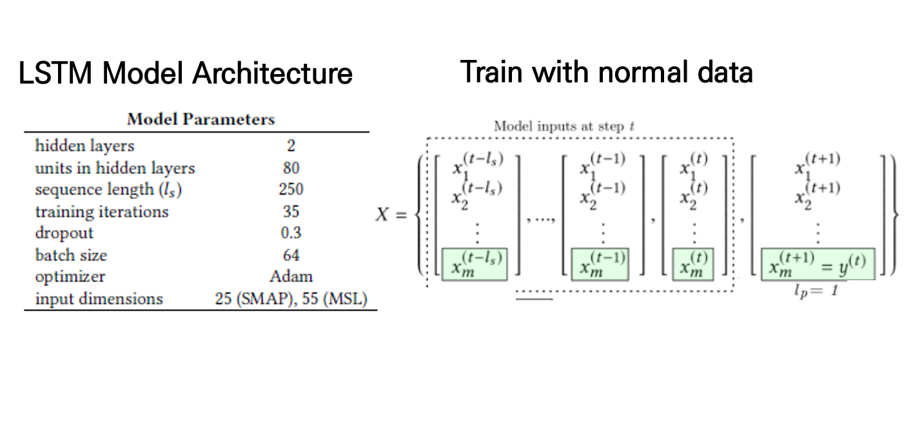
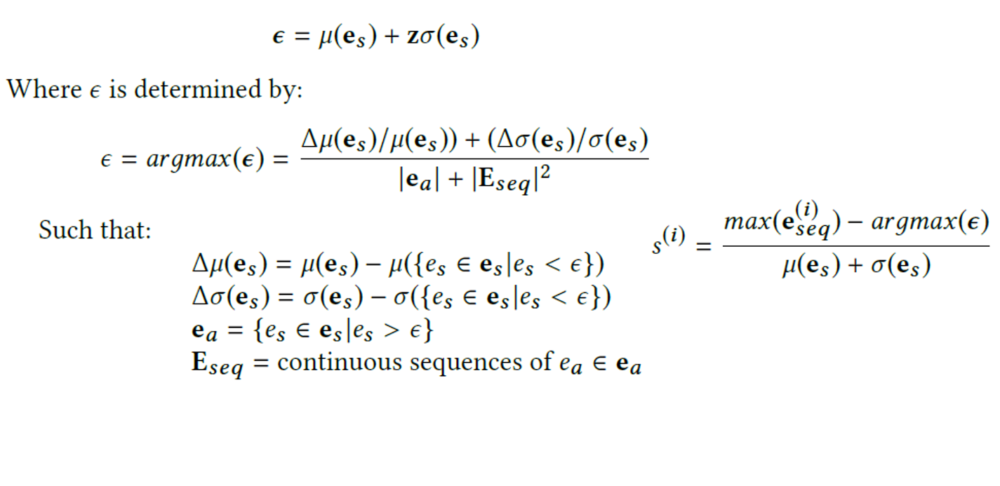
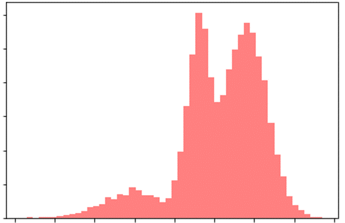

# Time Series Anomaly Detection - Paper Summary

* 작성자 : (주)인스페이스 미래기술실 연구원 __박상민__ __이현호__
* 일시 : 2018.01.07

* 이 글은 제가 2018년 8월부터 12월까지 약 4개월간 이상감지(Anomaly Detection)를 연구하게 되면서 공부했던 것, 알아낸 것, 찾아봤던 자료, 구현체, 결과물 등을 정리해서 공유하는 글 입니다. 
아직 지식이 많이 부족하고, 경험이 부족하기 때문에, 고칠 것도 많을 것 같습니다. 고처야 할 부분은 언제든지 연락주시면 감사하겠습니다 :)

## 연구 문헌 선행 조사

###  __개요__

* 이번글의 중점은 조사했던 11개 논문을 정리하는 것 입니다. 논문을 조사하고 읽은 목적은 다른 곳에서는 어떤식으로 데이터를 구축하는지, 어떤 문제를 해결하려고 하였는지, 모델 성능평가는 어떻게 하는지, 어떤 방법으로 연구하는지 등의 흐름을 얻기 위해 간단하게 조사한 것 입니다. 논문 중 꼭 자세히 읽어야 하는  부분은 좀 더 자세히 읽었습니다.
    
* 아래는 제가 읽은 11개 논문중 10개에 대해서 간단하게 분류한 것 입니다.
    

    * 위 사진을 보면 어떤 논문이 어떤 모델을 썼는지, 시계열 데이터 사용 유무 등을 한번에 볼 수 있습니다. 예를들어 5번 논문의 경우 시게열 데이터를 사용했고, SVM 모델을 사용했습니다. 원이 겹쳐져있는 경우는 두 개를 같이 사용했다는 뜻 입니다. 즉, 5번 논문은 SVM모델과 DNN + LSTM를 동시에 사용한 모델이라는 뜻 입니다.

### __논문 요약 정리__

1. Applications of Deep Learning Neural Networks to Satellite Telemetry Monitoring [1](https://elib.dlr.de/121211/1/6.2018-2558.pdf)

    * 기존의 자동원격모니터링 시스템은 이상위험을 감지하지 못한다고 저자는 말합니다.
    * 그래서 본 논문에서는 새로운 3개지의 Application을 제안합니다.
    * Autoencoder(오토인코더)
        * 오토인코더 모델을 이용한 자동 피쳐 추출
        * 오토인코더 모델을 이용한 이상감지
    * Multi LSTM-layer
        * 예측 모델을 이용하여 4시간 30분 후의 Telemetry value를 예측 -> 이상 예측
    * False Positive를 줄이고, 다양한 형태의 이상을 감지하였다고 논문에서는 밝힙니다.

2. Performance assessment of NOSTRADAMUS & other machine learning-based telemetry monitoring systems on a spacecraft anomalies database [2](https://arc.aiaa.org/doi/pdf/10.2514/6.2018-2559)

    * 최근 몇년동안 머신러닝을 이용한 새로운 탐지방법들이 제안되었다고 말하고 있습니다.
    * 저자는 여러개의 이상감지 방법들을 정량적으로 비교할 때 얻은 평가방법론과 결과를 제시하고자 하였습니다.
    * 저자는 머신러닝 모델을 학습하는 방향(방법)이 성능 향상에 큰 영향을 미치지 않았다는 것을 강조합니다.
    * 데이터의 전처리가 결과에 많은 영향을 주었다고 합니다.
    * 머신러닝에서 가장 중요한 작업은 데이터의 이해, 문제정의, 최적의 방법찾기라고 논문에서는 말합니다.
    * 논문에서는 머신러닝 모델의 성능만 중요한게 아니라, 결과의 해석 가능성, 처리시간(계산 시간), 새로운 데이터에 시스템 업데이트 유무라고 밝힙니다.

3. A Multimodal Anomaly Detector for Robot-Assisted Feeding Using an LSTM-based Variational Autoencoder [3](https://arxiv.org/pdf/1711.00614.pdf)

    * 본 논문의 동기는 밥을 먹는데 도와주는 로봇이 구조적, 하드웨어적 문제로 종종 오류가 발생해서 발생한 오류(이상)들을 감지하는 시스템을 개발하는 것이었습니다.
    * 위와 같은 구조적, 하드웨어적 이상들을 감지하는 시스템이 없다면 로봇이 자주 고장나게 되고, 수리비용이 높아지며, 사용자들이 더 이상 사용하지 않을 수 있는 문제점이 있다고 합니다.
    * 비정상적인 이상 상황들을 검출하고, 인식한다면 미리 예방이 가능하다고 논문에서는 말하고 있습니다.
    * LSTM-VAE(LSTM based variational autoencoder)를 이용해 Anomaly Score를 계산하였습니다. 
    
    * Anomaly Score가 Threshold를 넘어서게 되면 이상이라고 판단을 합니다.
    * 논문에서는 기존의 여러 방법들을 적용해 보았지만 LSTM-VAE모델의 성능이 가장 좋았다고 합니다.

4. Deep learning for anomaly detection in multivariate time series data [4](https://users.informatik.haw-hamburg.de/~ubicomp/arbeiten/master/assendorp.pdf)

    * 본 글은 자신들이 연구한 연구내용만 있는 것이 아니라, 머신러닝/딥러닝 기반의 다양한 이상감지 기법들의 내용이 포함되어 있습니다. 꼭 읽어보시면 좋을 것 같습니다.
    * 기계 장치들에서 비정상적인 활동을 감지하는 것은 기계 부품에 손상을 줄 수 있는 고장을 방지하는 중요한 작업이라고 합니다.
    * 지금까지의 모니터링 시스템은 도메인 지식이 풍부한 도메인 전문가가 있어야 하며, 이는 비용이 많이 든다고 말합니다.
    * 글에서는 최근 많은 연구들에서 보듯이, 딥러닝은 다변수, 시계열 데이터에서 강력한 이상감지 능력을 보여주었다고 하고 있습니다.
    * 딥러닝을 적용하게되면, 도메인 전문가가 하던 feature 엔지니어링 작업을 최소한으로 줄일 수 있기 때문에 많은 비용을 줄일 수 있다고 합니다.
    * 본 글에서는 세탁기의 다변수 + 시계열 데이터를 사용하여 Autoencoder-base와 GAN-base의 이상감지를 비교하였습니다.

5. Anomaly Detection for a Water Treatment System Using Unsupervised Machine Learning [5](https://arxiv.org/pdf/1709.05342.pdf)

    * CPS(Cyber-Physical System)는 물리적 프로세서와 상호작용하는 컴퓨팅 요소로 구성된 복잡한 시스템입니다.
    * CPS에서는 제어요소, 네트워크 또는 물리적 공격으로 이상현상이 일어날 수 있다고 논문에서는 말합니다.
    * 본 논문에서는 CPS상의 이상을 감지하는 방법에 대해서 두 가지의 비지도학습 방안을 제안하였고, CPS시스템에 적용하였습니다.
    * 두 가지 방안은 LSTM layer가 있는 DNN 네트워크와 SVM을 사용하는 방안입니다.
    * 실제로 적용해보니, DNN 네트워크가 Precision과 F-score가 더 높았고, SVM이 Recall이 더 높았다고 말말합니다.
    
    * 하지만 DNN네트워크는 학습에 2주가 걸렸고, SVM은 30분이 걸렸다고 설명합니다.
    * 두 가지 방법모두 센서 값의 점진적인 변화를 탐지 못하는 한계점도 있었다고 논문에서는 밝힙니다.

6. Long Short Term Memory Networks for Anomaly Detection in Time Series [6](https://www.elen.ucl.ac.be/Proceedings/esann/esannpdf/es2015-56.pdf)

    * 기존의 모니터링 방식은 통계적 방식을 이용하지만, time window 매개변수를 미리 지정해줘야 하며, 이는 결과에 큰 영향을 끼친다고 합니다.
    * LSTM 네트워크는 window 사이즈를 지정해 줄 필요가 없으며, ‘memory cells’를 통해 vanishing gradient 문제를 해결하였다고 설명하고 있습니다.
    * LSTM 네트워크는 장기 패턴이 있는 시퀀스를 학습하는데 매우 유용하며, 레이어를 쌓으면 더 높은 수준의 시간적인 특징을 학습할 수 있다고 설명하고 있습니다.
    * 본 논문에서는 stacked LSTM 네트워크를 이용해 window를 정해주거나 전처리 없이 이상감지를 할 수 있음을 보여주었습니다.
    * 데이터는 ECG, 우주 왕복선, 전력 수요, 엔진 센서 데이터 셋을 이용하였고, normal 데이터로 훈련을 하였다고 말하고 있습니다.
    * Stacked 된 LSTM 네트워크는 좋은 성능을 보여주었고, RNN보다 LSTM 네트워크가 성능이 더 좋았다고 밝히고 있습니다.          
    

7. Anomaly Detection with Generative Adversarial Networks for Multivariate Time Series [7](https://arxiv.org/pdf/1709.05342.pdf)

    * 오늘날 CPS 시스템은 크고, 복잡하며, 사이버 공격의 목표가 되는 network sensor와 actuators가 부착되어 있다고 눈문에서는 설명합니다.
    * 기존의 이상감지 기법 들은 역동적이고, 복잡한 것 들을 감지할 수 없다는 단점을 논문에서는 밝힙니다.
    * 비지도학습(Unsupervised)기반의 머신러닝 기법을 이용해 비정상적인 동작을 공격으로 분류할 수 있다고 합니다.
    * 본 논문에서는 복잡한 네트워크를 위한 새로운 Generative Adversarial Networks-based Anomaly Detection(GAN-AD) 방안을 제안하였습니다.
    * GAN모델 내에있는 LSTM-RNN이 다변수 시계열 데이터의 분포를 capture합니다.
    * 각 센서와 액추에이터 시계열 데이터를 독립적으로 처리하는 대신, 시계열 데이터를 동시에 모델링하여 잠재적인 상호작용을 고려한다고 설명합니다.
    * Secure Water Treatment Testbed(SWaT) 데이터 셋을 사용해 테스트를 하였으며, 다른 비지도학습 이상감지 기법보다 성능이 좋았다고 말하고 있습니다.
    

8. LSTM-based Encoder-Decoder for Multi-sensor Anomaly Detection [8](https://arxiv.org/pdf/1607.00148.pdf)

    * 엔진, 차량, 항공기 등과 같은 기계 장치에는 일반적으로 기계의 상태나 동작을 캡처하는 수많은 센서가 있습니다. 그러나 종종 센서에 포착 되지 않는 외부요인, 변수들이 많으며, 이는 본질적으로 예측할 수 없는 시계열 데이터로 이어집니다. EX) 수동 제어, 모니터링 되지 않는 환경과 조건 등
    * 이러한 상황에서 수학에 의존하는 모델을 사용하는 것은 어렵다고 논문에서는 기존 이상감지 방식의 한게점을 말하고 있습니다.
    * 본 논문에서는 정상 데이터를 학습 후 reconstruction error를 이용해 이상감지를 하는 LSTM-based Encoder-Decoder Anomaly detection을 제안합니다.
    * EncDec-AD를 통하여 예측가능한, 예측불가능한, 주기적인, 불규칙적인, 준 주기적인 시계열데이터에서 이상징후를 할 수 있으며, 짧은 주기(30)의 시계열과 굉장히 긴 주기의 시계열(500)에서도 이상징후를 감지할 수 있다고 말하고 있습니다.
    * 논문에서는 전력수요, 우주 왕복선, ECG, 그리고 2개의 real-world 엔진 데이터 셋을 이용해 실험을 진행하였다고 합니다.

9. Time Series Anomaly Detection [9](https://arxiv.org/ftp/arxiv/papers/1708/1708.03665.pdf)

    * 구글의 실시간 트래픽 데이터에서 이상을 감지하기 위해서 연구를 시작하였다고 논문에서는 밝힙니다.
    * 데이터는 노이즈가 있고, 트래픽 패턴이 있는 주기적인 데이터에서 이상을 감지하기위해 머신러닝 기법과 통계적 기법으로 접근하였다고 합니다.
    * 많은 양의 라벨된 데이터가 없기 때문에 지도학습(supervised)의 분류 문제로 접근할 수 없었으므로, 두 부분으로 문제에 접근하였다고 하는데 다음과 같습니다.
        * 첫 번째는, regression과 시계열 데이터에서 값을 예측하기위해 텐서플로우를 이용하여 DNN, RNN, LSTM을 포함한 다양한 모델을 학습시킨 것 것 입니다.
        * 두 번째는, 실제 값과 예측값을 비교하는 anomaly rule(이상탐지 규칙)을 만들어 비교한 것 입니다.
    * 논문에서는 두 개의 이상탐지 규칙은 트래픽 데이터가 잠시 지연되거나, 일시적으로 값이 튀는 것보다 지속적인 이상(sustained anomalies)를 찾는 문제에 더 초점을 두었다고 설명합니다.
    * 모든 모델의 결과를 분석해 보니 논문에서 사용한 이상탐지 규칙이 효과적이었다고 밝히고 있습니다.
    * 논문에서는 모델과 규칙들을 여러가지 조합으로 실험을 진행하였는데, 두 개의 규칙의 교차점을 사용하면 거의 모든 모델에서 이상을 찾아낼 수 있었다고 합니다.
    * 통계적인 베이스가 있는 이상감지 규칙과, 사용자가 반복적으로 false positive를 수동으로 제거할 수 있도록 쉽게 수정할 수 있는 규칙은 이상징후를 탐지할 수 있는 매우 강력한 방법이라고 말하고 있습니다.
    

10. Detecting Spacecraft Anomalies Using Nonparametric Dynamic Thresholding [10](https://arxiv.org/pdf/1802.04431.pdf)

    * 본 논문은 NASA에서 작성하였습니다. 

    * 논문에서 말하는 Spacecraft Anomaly Detection의 기존 모니터링 시스템 방법은 다음과 같습니다.
        * OOL (Out of Limit)
            * 사전에 정의된 limit 값을 기준으로 이상치 탐지
        * Expert system
            * 전문가들의 지식을 이용하여 순서도를 만들어 이상치 탐지
        * Distance based
            * 특징 추출 후 군집화를 진행하여 거리 기반 이상치 탐지
        * Density based
            * 특징 추출 후 군집화를 진행하여 밀도 기반 이상치 탐지
        * Visualization
            * 특징 추출 후에 시각화를 하여 전문가들의 소견으로 이상치 탐지

    * Spacecraft 이상감지 모니터링 시스템의 문제점은 다음과 같습니다.
        * 기존의  spacecraft에서 원격으로 보내준 데이터(telemetry)들의 이상감지 모니터링을 하는 시스템을 유지하는데 굉장히 많은 비용과 전문지식이 필요하다.
        * 현재의 이상탐지 방식은 값이 사전 정의 된 한계를 벗어나는 방법, 시각화 및 통계를 통해 수작업으로 분석하는 방법을 사용하는 경우가 많다.
        * OOL기법이 많이 증가하고 있지만, 데이터의 양이 증가하면서 한계점이 드러나고 있다.
        * 이런 문제는 Spacecraft에서 보내주는 데이터가 많을수록,  점점 더 악화될 것 이다. (NISAR라는 위성은 하루에 85테라바이트의 데이터를 보냄)

    * 기존 모니터링 시스템의 문제점을 요약하자면 다음과 같습니다.
        * 전문 인력 필요
        * 고도의 전문 지식 필요
        * 이상치를 잘 놓치는 경향이 있음
        * 축적 데이터 기반으로 하여 메모리 과부하
        * 과도한 계산으로 인한 컴퓨팅 파워 부족  

    * 논문에서는 다음과 같은 해결방법을 제안하였습니다.

        * 다변수의 시계열 데이터에서 이상징후를 찾는 것은 엄청난 도전이다.
        
        * SMAP인공위성과 MSL rover의 라벨링 된 데이터를 이용하여 LSTM을 사용해 문제들을 극복하고자 한다.
        
        * 기존의 방식들은 시계열 데이터에서 시간과 관련된 이상징후를 누락하는 문제점 등이 있어, LSTM과 같은 순환신경망으로 이를 해결하고자 한다.
        
        * OOL의 한계점을 순환신경망으로 접근한다면 해결할 수 있다.
        
        * 최근들어 획기적으로 신경망(NN)이 sequence to sequence를 포함한 다양한 분야에서 향상되었기에 가능하다고 보고있다.

        * LSTM의 예측성능은 기존의 항공우주산업 프로그램에서 담을 수 없던 시간정보를 담을 수 있기 때문에 매우 중요하다.
       
        * 무엇보다 LSTM은 과거의 데이터를 기억하고, 현재 예측에 영향을 미치는 구조가 효과적이고, 다변수인 상황에서 차원 감소나, 도메인 지식이 없어도 시계열 데이터를 잘 표현할 수 있다는 것이 장점이다.
       
        * LSTM의 장점들이 모티브가 되서 LSTM네트워크를 이상감지에 적용시켰다.
       
        * LSTM네트워크를 이용해 정상 telemetry sequences와 command를 예측하는 것을 학습하고, unsupervised thresholding을 사용해 데이터를 자동 평가하고, 이상을 감지한다.

    * LSTM 모델 구조를 보여주는 사진입니다. 모델은 normal(정상)데이터로 학습을 진행합니다.
    

    * 모델의 입력, 출력(예측), error setting의 시퀀스를 보여주는 사진입니다. error를 이용해 threshold를 설정하고, 이상감지를 진행합니다.
    

    * Non-Parametrict Thresholding 수식입니다. Error 값에 따라 threshold가 유동적으로 바뀌게 됩니다. Unsupervised thresholding 기법이라고 설명하고 있습니다.
    

    * 다양한 Threshold 기법을 적용한 모델 성능지표입니다. Non-Parametric 기법과 Pruning(가지치기)기법을 사용하였을 때 가장 좋은 성능이 나왔습니다.
    

    * 실제 저자가 사용한 데이터 셋 입니다. Github에 올려져 있습니다. 학습 셋과 테스트 셋이 나뉘어져 있습니다. 학습셋은 정상 데이터, 테스트 셋은 정상 + 비정상데이터(라벨링 된)로 구성되어 있습니다.
    

    * 테스트 셋은 라벨링 되어 있습니다(labeled_anomalies.csv 참고). 이상구간 인덱스와, 이상의 종류, 데이터 셋 이름 등의 대한 정보가 csv파일형태로 구성되어 있습니다.
    

    * 'labeled_anomalies.csv' 파일 상세설명 입니다. 이상의 종류(point, contextual)까지 라벨링 하였습니다. 
    

    * 아래는 테스트 데이터 셋을 이용한 모델 성능평가 담긴 사진입니다.
    

11. A Data-Driven Health Monitoring Method for Satellite Housekeeping Data Based on Probabilistic Clustering and Dimensionality Reduction [11](https://ieeexplore.ieee.org/stamp/stamp.jsp?tp=&arnumber=7859276)

    
    * 'A Data-Driven Health Monitoring Method for Satellite Housekeeping Data Based on Probabilistic Clustering and Dimensionality Reduction' 논문입니다.
    * JAXA와 도쿄대학교에서 작성한 논문입니다. 인공위성 Telemetry 데이터를 사용하였습니다.
    * 위성 Telemetry의 특징 분석, 전처리 기법등을 위주로 읽어보았습니다.

    * 논문을 요약하자면 다음과 같습니다.
        * 인공위성 운영에 있어서 시스템의 상태를 모니터링하고, 이상징후를 감지하는 것은 매우 중요하다.
        * 최근에는 과거에 수집 된 많은 양의 측정 데이터에 적용되는 데이터 중심 접근법이 주목을 받고 있다.
        * 본 논문에서는 데이터 기반의 새로운 모니터링 방법과 이상 검출 방안을 제안한다.
        * 새로운 방법은 probabilistic 차원축소 및 클러스터링 기반이다.
        * 일본 항공우주국의 소형 시범위성 Telemetry에 적용, 평가하였다.
        * 고차원, Multimodality 등의 특성을 가지고있는 위성 Telemetry에 적합하다.
        * Anomaly score, 클러스터 결과 등을 운영자에게 정보 제공한다.
        * 위성의 인공 Telemetry에 2년 이상 적용해 검증 받았다.
        * 본 연구를 바탕으로 space craft에 대한 범용적인 모니터링 시스템 개발할 예정이다.

    * 논문에서는 데이터를 머신러닝 모델에 적용하기 전에 데이터의 특성을 이해하는게 중요하다고 말합니다. 논문에서는 아래의 총 6가지의 위성 Telemetry 특징에 대해서 설명합니다.
        * High Dimensionality (고차원)
        * Multimodality (복합성)
        * Heterogeneous (이질성)
        * Temporal Dependence (시간 종속성)
        * Missing Data (누락 데이터)
        * Trivial Outliers (사소한 이상치들)

    * 논문에서 위성 Telemetry의 특징을 다음과 같이 분석하였습니다.
        * __High Dimensionality (고차원)__
            * 위성의 Telemetry 데이터는 고차원이다.
            * 변수가 수백 ~ 수천개에 이른다.
            * 데이터 샘플 간의 거리를 정확하게 측정하지 못한다.
            * 위와 같은 문제들을 차원의 저주라고 한다.
            * 간단한 거리기반의 이상감지 알고리즘은 인공위성의 Telemetry 데이터에 적합하지 않다.
            * 위성 Telemetry 데이터들은 서로 강하게 연관되어 있으므로, 실질적인 차원은 훨씬 낮다.

        * __Multimodality (복합성)__
            * 위성 시스템은 여러 가지의 동작 모드들을 가지고있다. 
            * 시간에 따라 모드가 바뀌기도 한다.
            * 지구궤도위성의 기본적인 모드는 낮과 밤이 바뀌는 모드이다.
            * 이 두개의 모드 사이에서는 발전량 또는 표면적인 온도의 뚜렷한 차이가 있다.
            * 결과적으로 위성의 Telemetry 데이터의 분포는 Multimodal이 되고, 샘플은 데이터 공간에서 다중 클러스터로 구성된다.=

        * __Heterogeneous (이질성)__
            * 위성 Telemetry 데이터는 두 가지 타입으로 나뉘어진다.
            * 실제 값을 갖는 continuous한 변수
                * Ex)온도 등의 센서 값, 전력 값

            * 범주형(categorical) 값을 갖는 이산형 변수
                * 정수로만 되어있음
                * Ex)낮과 밤, 어떤 모드들의 정수 값 등

        * __Temporal Dependence (시간 종속성)__
            * 인공위성 시스템은 동적 시스템이므로 다변수의 시계열 데이터이다.
            * 시간적인 특징은 위성 Telemetry 데이터의 필수적인 속성이며, 모니터링에도 매우 유용하다.
            * 여러 변수에서 값이 한 번에 변경되면 이벤트가 발생되었다고 볼 수 있다.
            * 하지만, 이 연구에서는 trivial(사소한) outlier를 탐지하는데 초점을 맞추었다.

        * __Missing Data (누락 데이터)__
            * *논문에서도 실제로 'missing data'라고 표현을 하고 있어, 누락데이터라고 포현을 하였습니다. 하지만 여기서의 missing은 들어와야 할 데이터가 안들어오는 상황 보다는, 데이터의 샘플링 주기가 달라 비어있는 상황을 말합니다.*

            * 대부분의 spacecraft 시스템에서는 샘플링 기간과 주기가 다르므로, 모든 변수의 값이 얻어지는 건 아니다.
            * 자세, 각도 및 속도 등은 높은 샘플링 속도를 가지고 있고, 온도 등은 낮은 샘플링 속도를 가지고 있다.
            * 위성 Telemetry 데이터의 대부분은 누락(missing)된다.
            * 대부분의 머신러닝 알고리즘들은 기본적으로 데이터가 완벽하다고 생각한다.
            * 위성 Telemetry 데이터를 머신러닝 모델에 적용할 때, 누락된 데이터를 처리할 수 있도록 수정하거나, 누락된 요소들을 미리 복구하기위한 전처리를 해주고, 학습 알고리즘에 제공해주는 작업이 필요하다.
            
            * 아래사진은 논문에서 missing data의 missing 여부를 시각화 한 것입니다. 흰색은 누락된 부분이고, 검은색은 누락되지 않은 부분입니다.
            

        * __Trivial Outliers (사소한 이상치들)__
            * 위성 Telemetry 데이터에서는 가끔씩 굉장히 큰 이상데이터들이 데이터 변환 또는 전송오류로 생길 수도 있습니다.
            

            * 위성 Telemetry 데이터에서는 가끔씩 굉장히 큰 이상데이터들이 데이터 변환 또는 전송오류로 생길 수도 있다는 것 이다.
            * 중요한 점은 이러한 오류들(point)이 오직 데이터 변환 또는 전송 오류로만 인해서 발생하고, 심각한 이상징후를 나타내지 않는 것 이다.
            * Trivial outlier는 심각한 오류와는 차별화되야 하며, 그 발견이 논문의 목적 중 하나
            * Trivial outlier는 절대값이 굉장히 크기 때문에, 심각한 오류나 예외들의 값이 안보일 수 있다. (숨겨질 수도 있다)
            * 훈련데이터에 매우 큰 값을 가진 trivial outlier들이 포함되면 학습 된 모델이 손상될 수 있다.

    * 논문에서 말하는 위성 Telemetry 전처리 방법은 다음과 같습니다.

        * 위성 Telemetry 데이터의 특징 중 일부는 데이터 전처리 단계에서 처리될 수 있고, 이러한 작업은 머신러닝에 적용하는 것을 더 쉽게 할 수 있도록 한다고 합니다.
            * 총 3가지의 전처리 방법을 소개하였습니다.
                * Detection and Removal of Trivial Outliers
                * Missing value completion
                * Normalization 
            
        * __Detection and Removal of Trivial Outliers__
            * Trivial outlier 데이터들은 모델 학습과 테스트에서 데이터 기반 비정상 탐지를 방해한다.
            * 2가지의 뚜렷한 성격이 있다.
                * 매우 드물게 갑작스럽게 발생
                * 그 값은 비슷한 시간에 있는 값들과 매우 다르다는 것

            * Trivial outliers를 탐지하고, 제거하기 위한 수식입니다. 상한선과 하한선을 설정하고, 상하한선을 넘을 경우 제거합니다.
            

        * __Missing value completion__
            * 위성의 Telemetry 데이터는 변수들마다 샘플링 주기와 타이밍이 다르기 때문에 구조적으로 데이터 누락이 발생할 수 있다,
            * 본 논문에서는 단순한 방법을 사용하였다.
            * 각각의 누락된 값이 바로 앞의 값으로 대체되는 ‘piecewise constant interpolation’이라는 보간법을 사용하였다.
            * 선형 및 다항식 보간과 같은 고급 방법을 선택하지 않은 이유는 노이즈에 영향을 받아 다른 변칙적인 값을 생성할 수 있기 때문이다.

        * __Normalization__
            * 위성의 Telemetry 데이터는 실제 단위와 변수의 범위 등이 다양하기 때문에, 일반적인 다변수로 보는 것은 무리가 있다.
            * 범위를 변환하는 작업 등을 통해서 모든 Telemetry 데이터를 정규화해서 균일하게 사용할 수 있도록 하였다.
            * Categorical(범주형) 변수의 값들은 각 변수 빈도를 내림차순으로 1씩 증가하는 값으로 대체한다.
                * Ex)’DIS’ / ‘ENA’ Telemetry가 각각 0.8, 0.2의 확률이라면 DIS는 1이고, ENA는 0이다.

    * 논문에서는 Anomaly Score를 산출하는 방법의 대해서도 작성하였습니다. Anomlay Score를 모니터링 담당자에게 중요한 지표가 될 것이라고 하였습니다.
        * 논문에서는 수식적으로 복잡하게 작성되어있습니다. __이현호__ 연구원께서 관련 부분을 이해하는데 많은 도움을 주셨습니다.

        * Anomaly Score는 내가 뽑은 데이터 샘플의 희귀한 정도를 수치화시켜 나타낸 것 입니다.(희귀할수록 score는 높아지게 됩니다.)  
        

        * Anomaly Score는 Gaussian Mixture Model를 사용하였습니다. 간단하게 방식에 대해 설명드리기 전에 Guassain Mixture Model의 대한 설명을 잠깐 드리고, anomaly score를 산출하는 방법에 대해 간단하게 설명하겠습니다.
            GMM(Gaussian Mixture Model)은 데이터가 K개의 정규분포로부터 생성되었다고 보는 모델입니다.  
            
              
            위 사진의 분포를 더 자세히보면 아래 사진과 같은 3개의 정규분포로 되어있는 걸 볼 수 있습니다.  
              
            위 사진과 같이 GMM은 K개의 정규분포로 데이터가 생성되었다고 보는 모델입니다.  

            아래사진처럼 2차원과 3차원에서도 가능합니다.  
                

            아래와 같이 C1 ~ C6까지 총 6개의 클러스터링 된 굉장히 이상적인 데이터 분포가 있다고 생각을 해보겠습니다.  
              

            각 클러스터의 데이터 샘플들의 개수는 다음과 같습니다.  
                  

            각 클러스터들의 데이터 샘플 개수가 위의 사진과 같다면, 전체 데이터 중 하나의 데이터를 뽑았을 때 그 데이터의 클러스터를 뽑을 확률을 구해야합니다.  
              
            만약 내가 C1에 속한 데이터를 하나 뽑았다면, 확률 p는 1/5일 것 입니다.  C6에 속한 데이터를 하나 뽑았다면, p는 1/40일 것 입니다. 즉 클러스터에 속한 데이터 샘플들의 개수가 적을수록 p는 낮아질 것 입니다.  
            아래 사진을 참고하시면 한눈에 들어올 수 있을 것 같습니다.  
              

            아까 구한 p의 -log를 계산합니다. -log를 씌우게 되면 값이 p가 1에 가까울수록, -log(p)는 0에 수렴합니다. 반대로 p가 0에 가까울수록, -log(p)는 무한대로 발산하게 됩니다.
              

            아래 사진과 같이 p확률을 구하고, -log(p)를 계산하면 우리가 원하는 anomaly score가 나오게 됩니다. p가 낮을 수록, score는 높아지게 되는 것이고, 이는 내가 뽑은 하나의 데이터가 속한 클러스터에서 그 클러스터에 속한 데이터 개수가 적을수록, p는 높아질 것이고, score도 높아진다는 것 입니다.  
                  

* 참고자료
    * [1] Applications of Deep Learning Neural Networks to Satellite Telemetry Monitoring  
    https://elib.dlr.de/121211/1/6.2018-2558.pdf  

    * [2] Performance assessment of NOSTRADAMUS & other machine learning-based telemetry monitoring systems on a spacecraft anomalies database   
    https://arc.aiaa.org/doi/pdf/10.2514/6.2018-2559

    * [3] A Multimodal Anomaly Detector for Robot-Assisted Feeding Using an LSTM-based Variational Autoencoder  
    https://arxiv.org/pdf/1711.00614.pdf

    * [4] Deep learning for anomaly detection in multivariate time series data  
    https://users.informatik.haw-hamburg.de/~ubicomp/arbeiten/master/assendorp.pdf 
    
    * [5] Anomaly Detection for a Water Treatment System Using Unsupervised Machine Learning   
    https://arxiv.org/pdf/1709.05342.pdf

    * [6] Long Short Term Memory Networks for Anomaly Detection in Time Series  
    https://www.elen.ucl.ac.be/Proceedings/esann/esannpdf/es2015-56.pdf

    * [7] Anomaly Detection with Generative Adversarial Networks for Multivariate Time Series -  
    https://arxiv.org/pdf/1709.05342.pdf

    * [8] LSTM-based Encoder-Decoder for Multi-sensor Anomaly Detection  
    https://arxiv.org/pdf/1607.00148.pdf 

    * [9] Time Series Anomaly Detection 
    https://arxiv.org/ftp/arxiv/papers/1708/1708.03665.pdf 

    * [10] Detecting Spacecraft Anomalies Using Nonparametric Dynamic Thresholding  
    https://arxiv.org/pdf/1802.04431.pdf

    * [11] A Data-Driven Health Monitoring Method for Satellite Housekeeping Data Based on Probabilistic Clustering and Dimensionality Reduction  
    https://ieeexplore.ieee.org/stamp/stamp.jsp?tp=&arnumber=7859276
