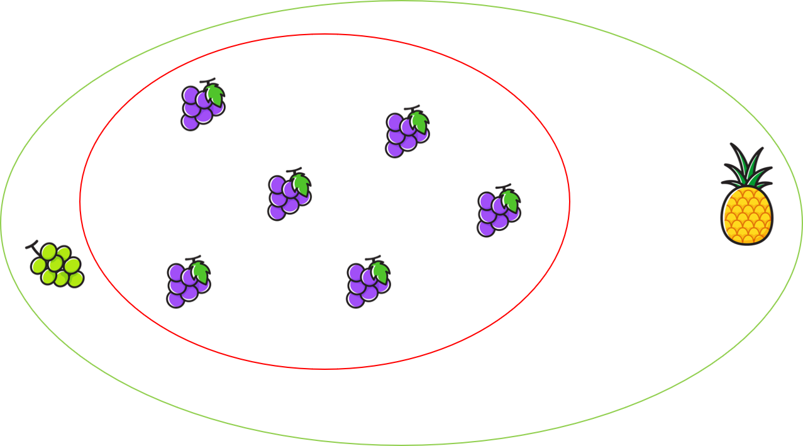
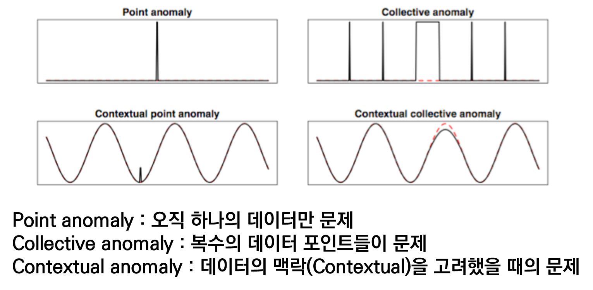

# Time Series Anomaly Detection - with DeepLearning

* 작성자 : 박상민 - (주)인스페이스 미래기술실 연구원 
* 일시 : 2018.01.10

* 이 글은 제가 2018년 8월부터 12월까지 약 4개월간 이상감지(Anomaly Detection)를 연구하게 되면서 공부했던 것, 알아낸 것, 찾아봤던 자료, 구현체, 결과물 등을 정리해서 공유하는 글 입니다. 주관적인 내용이 포함되어 있으니 이해해주시기 바랍니다. 항공우주분야의 이상감지를 연구해왔기 때문에 글의 내용도 도메인에 밀접한 내용이 있으니 참고하시면 좋을 것 같습니다.
아직 지식이 많이 부족하고, 경험이 부족하기 때문에, 고칠 것도 많을 것 같습니다. 고처야 할 부분은 언제든지 연락주시면 감사하겠습니다 :)

## Anomaly Detection(이상감지) Summary

### Anomaly Detection(이상감지)

 * 이상감지
    * 말 그대로 '이상'을 감지하는 것입니다. 어떤 데이터들 중에서 '이상한 것'들을 찾는 것 입니다. 시계열 데이터에서 과거 또는 현재의 시점에서 보편적인 패턴에서 벗어나거나, 벗어나려는 징후가 있는 드문 패턴 또는 이상 패턴을 찾아내는 것 입니다.

    * 이상감지는 모든 분야에서 적용될 수 있고, 오래전부터 다양한 기법이 개발되고 연구되어 적용되었습니다. 하지만 제가 지금까지 보고, 들은바에 의하면 뚜렷한 대책, 기법은 없는 것 같습니다. 머신러닝 기반의 이상감지는 각자 도메인에 맞게 도메인 지식과 머신러닝 기법을 동시에 적용하는 경우가 많았습니다.

    * 이상감지와 관련된 사업이 굉장히 커질것이고, 무궁무진하다고 생각합니다. 지금까지 우리는 '연구'와 '개발'에만 초점이 맞추어져 있었습니다. 하지만, 시간이 지나면서 제품이든, 건물이든 유지보수의 비용이 크게 증가하게 됩니다. 이는 제품 또는 건축물이(이동수단, 인공위성, 발전소, 고층빌딩 등) 복잡하고, 크고, 비용이 많이 들어갈수록, 시간이 흐르게되면 유지보수의 비용이 크게 증가하게 됩니다. 유지보수에 연구, 개발비용보다 막대한 비용이 들어가게 되고, 관련 인력들도 많이 필요하게 됩니다. 사람 또는 살아있는 생물의 안전과 관련된 시스템들은 위험상황이나 재난상황에서 이상 상황을 최대한 빨리 감지하고, 대응하는게 무엇보다 중요합니다. 이상감지 시스템은 모든 산업분야에 적용될 수 있고, 구축한 시스템이 복잡할수록, 비쌀수록, 희귀할수록 이상감지 시스템의 필요성은 커질 것 입니다. 지금까지는 '연구'와 '개발'에만 초점이 맞추어져 있었지만, 앞으로는 '유지보수'영역에도 많은 투자와 연구가 이루어질 것이라 생각합니다. 그럼에따라 이상감지 시스템의 필요성도 더 커질것이며, 시장도 계속해서 늘어날 것 입니다.

* 이상감지와 딥러닝
    * 이상감지는 머신러닝 영역이 아닙니다. 이미 머신러닝이 적용되기 전부터 게속해서 연구를 해왔었고, 수학적인 방법을 이용해 이상을 찾는 기법들이 존재합니다. 최근에 들어서 머신러닝 특히 딥러닝분야의 연구가 활발해지고, 성능이 좋은 모델들이 나오면서 딥러닝 기반의 이상감지 연구가 활발해지고 있습니다. 이상감지 연구의 가장 어려운 부분은 시계열 데이터에서 이상을 찾는 것 인데, 딥러닝 기반 순환신경망(RNN, LSTM)이 발전하면서 기존에는 담지 못했던 '시간'의 특징을 담을 수 있게 되었습니다.

    * 기존의 항공우주 분야의 이상감지 모니터링 방법은 다음과 같습니다.
        * OOL(Out of Limit) : 사전에 정의된 limit 값을 기준으로 이상치 탐지합니다.
        * Exper System : 전문가들의 지식을 이용하여 순서드를 만들어 이상치 탐지합니다.
        * Distance based : 특징 추출 후 군집화를 진행하여 거리기반 이상치 탐지합니다.
        * Denisty based : 특징 추출 후 군집화를 진행하여 밀도기반 이상치 탐지합니다.
        * Visualization : 특징 추출 후에 시각화를 하여 전문가들의 소견으로 이상치 탐지합니다.
    
    * 위와 같은 방법을 사용한 기존의 모니터링 시스템은 여러가지 문제점이 있습니다.
        * 역동적이고, 복잡한 데이터들에게서 이상을 감지할 수 없습니다.
        * 원격 데이터들의 이상감지 모니터링 시스템을 운영하는데 굉장히 많은 비용과 전문지식이 필요합니다.(도메인 전문가 필요)
        * OOL 기법 등의 기존 탐지 기법들은 데이터의 양이 증가하면서 한계점이 드러나고 있습니다.
        * 원격으로 보내주는 데이터의 양이 증가할수록, 기존 탐지 기법들의 한계가 드러날 것이며, 악화될 것 입니다.(NASA 논문에서는 NISAR위성이 하루에 85테라바이트의 데이터를 보낸다고 합니다.)
        
    * 위와 같이 기존의 이상감지 모니터링 방식은 한계점이 있습니다. 하지만 딥러닝 연구가 활발해지고, 성능이 좋은 신경망, 모델 등이 나오면서 앞으로는 딥러닝 기반의 이상감지 기법들을 많이 연구하게 될 것 같습니다. 하지만 딥러닝으로 접근하는 방식도 아직까지 뚜렷한 대책은 없는 것 같습니다. 딥러닝 기반의 이상감지 시스템이 뚜렷한 성과를 내지 못하고, 적용하기 어려운 이유는 '데이터'에 있다고 생각합니다. 각 도메인에서 딥러닝 기반의 이상감지 연구를 해보신 분들은 다 아실거라 생각합니다. 실제로 연구를 하다보면 가장 먼저 부딪히는게 데이터의 확보 입니다. 다음과 같은 문제를 가장먼저 만나게 됩니다.
        * 현실적으로 이상과 정상을 '분류'하려는 접근법에서는 이상이 있는 데이터를 확보하기가 쉽지 않습니다. (데이터 불균형 문제)
        * 도메인에서 이상하다고, 이상 데이터라고 규정할 사례(데이터)가 굉장히 적습니다.
        * 도메인 전문가가 판별한 이상 데이터가 실제로 다른 정상데이터와 뚜렷하게 구분되지 않은 경우가 많습니다. 명확하게 구분하기가 힘듭니다.
    
    * 위의 문제들은 지도학습의 분류문제로 접근하였을 때 쉽게 나타날 수 있는 문제점들 입니다. 즉, 이상감지를 분류문제로 접근해서 해결하기는 쉽지 않다는 것입니다.

    * 지도학습이 안된다면, 비지도학습(Unsupervised learning), 반지도학습(Semi-supervised learning)을 사용해야 합니다. 분류문제로 접근해서 문제를 해결하고자 한다면 가장 쉽겠지만, 현실적으로는 불가능합니다. 그렇기 때문에 라벨링이 필요없는(라벨링이 필요없다의 기준은 정상과 비정상 데이터가 명확히 구분된 상태를 말합니다.), 아주 소량의 데이터가 라벨링되어있는 상태가 대부분이고, 이는 지도학습이 아닌 비지도학습이나 반지도학습으로 접근하여야 합니다.

* 이상감지와 데이터
    * 위에서도 말씀드렸지만, 이상감지분야를 연구하다보면 가장 큰 문제는 데이터 입니다. 특히 시계열 데이터에서 '시간'적인 특성을 잘 고려해야 합니다. 지금까지의 OOL기법, 클러스터링 등은 시간적인 특성을 고려하지 않은 기법들입니다. 하지만 현실에서는 시계열 데이터가 대부분이고, 시간적인 특성을 가지고 있습니다. 위성에서 원격으로 보내주는 Telemetry 데이터 또한 시계열 데이터이고, 패턴이 있습니다. 
    
    * 정상과 이상을 정의하는 것도 중요합니다. 무엇이 정상이고, 무엇이 이상인지 도메인 전문가는 알고 있어야 합니다. 여기서 novelty와 anomaly의 차이를 알고가시면 좋을 듯 합니다. novelty의 뜻은 새로운이라는 뜻 입니다. 즉 novelty detection은 anomaly(이상)를 찾는것이 아니라, 정상과는 다른 새로운 패턴 또는 형태의 데이터를 찾는 것 입니다. 새로운 패턴, 형태의 데이터에는 어쩌면 anomaly(이상)가 있을수도 있습니다. 하지만 무조건 이상 데이터라고는 할 수는 없겠죠. 이상이라고는 할 수 없지만, 정상데이터와는 다른 새로운 데이터라고 생각하시면 될 것 같습니다. 범위로보자면 novelty가 더 큰 범위이겠네요.  
      
    위 사진을 보시면 더 수월하게 이해가 될 것 같습니다. 위와같이 과일이 있을 때, 보라색포도는 정상입니다. 보라색포도가 정상이라고 했을 때 위 그림에서 anomaly(보라색 포도와는 다른 과일)를 찾고자 합니다. 청포도와 파인애플은 novelty 데이터입니다. 보라색 포도(정상데이터)와는 다르니까요. 여기에서 청포도를 바라보는 사람에 따라 입장차가 있을 수 있습니다. 과일을 잘 모르는 사람이 봤을 때, 청포도가 anomaly 라고 생각할 수도 있습니다.(색이 다르기 때문에) 하지만 과일을 잘아는(과일상점 주인) 사람이 봤을 때는 청포도는 anomaly라고 단정하기 보다는 새로운 종류(novelty)의 포도라고 생각할 수도 있습니다.(색깔이 다를뿐 그 외에는 똑같기 때문에.. 등)

    * 우리가 novelty deection을 하고자 한다면, 청포도와 파인애플을 모두 찾는데 집중을 해야합니다. anomaly detection이라고 한다면, 파인애플을 찾는데 집중을해야겠죠. 관습적으로는 novelty/anomaly detection을 혼용해서 같은 의미로 사용하는 것 같습니다. 

    * 비정상데이터의 이해도 필요합니다. [그림 1](https://brunch.co.kr/@zedoring/2)  
     
    * Point anomaly : 오직 하나의 데이터에만 이상이 생긴 것 입니다. 데이터들의 그룹에서 떨어져있는 값 입니다. Point anomaly는 수월하게 찾을 수 있습니다. OOL, 클러스터링 등을 이용해서도 쉽게 찾을 수 있습니다.
    * Collective anomaly : 복수의 데이터 포인터들에게서 이상이 생긴 것 입니다. 
    * Contextual anomaly : 데이터의 맥락(Contextual)을 고려했을 때 생긴 이상이 생긴 것 입니다. 대부분의 시계열 데이터에는 contextual한 부분을 고려해야 합니다. 패턴이 있고, 정상적인 패턴중에서 비정상적인 패턴이 나오는 경우가 많습니다. 특히 4번째 contextual collective anomaly와 같은 이상데이터는 탐지하기가 굉장히 어렵습니다. 시계열 데이터의 이상감지를 연구하는 사람들의 최종목표는 contextual collective anomaly를 탐지하는 시스템을 개발하는 것이 아닐까 생각합니다.

    * 대부분의 데이터는 다변수 시계열 데이터입니다. 다변수 시계열 데이터일 경우, 각 변수들을 유사한 변수들끼리 묶어 그룹을 만드는게 중요합니다. 예를 하나 들어보겠습니다.
        > 우주선의 이상을 감지하는 시스템을 구축하고자 합니다. 100개의 변수가 있을 때 100개의 변수를 모두 하나의 그룹으로 생각해서 이상감지 시스템을 구축하는게, 우주선의 전반적인 상태를 모니터링 할 수 있다고 생각하여 하나의 그룹으로 시스템을 구축하였습니다. 시스템에서 이상이 생겼을 경우, 경고 알람을 보내줄 것입니다. 모니터링 담당자는 알람을 보고 대응을 하겠죠. 하지만, 현실적으로 대응을 하고자 할 때 세부적인 대응을 할 수가 없습니다. 우주선의 굉장히 많은 시스템 중에(1단 로켓, 2단 로켓, 엔진, 연료통, 궤도, 고도, 온도 등) 어떤 부분에서 이상이 생겼는지 알 수가 없기 때문입니다. 이제 담당자는 각각의 센서 그룹(1단로켓, 2단로켓, 엔진 등)에 해당하는 실제 데이터들을 살펴볼 것입니다. 엔진관련 변수들을 살펴보고, 1단 로켓 관련 변수들을 살펴 볼 것입니다. 총 10개의 그룹이 있다면 하나씩 다 살펴봐야겠죠?

    * 위 사례가 수백개의 변수가 있을 때 각 유사한 그룹으로 나누지않고, 하나의 전체적인 그룹으로 생각하고 시스템을 구축했을 때 생길 수 있는 문제점이라고 생각합니다. 또 다른 예를 하나 들어보겠습니다.
        > 우주선의 이상을 감지하는 시스템을 구축하고자 합니다. 100개의 변수가 있을 때 100개의 변수중에서 유사한 변수끼리(1단 로켓 변수는 1단로켓 변수 그룹으로 묶고, 엔진 변수들은 엔진 변수 그룹으로 묶는 등)그룹을 묶어 총 10개의 그룹을 묶었습니다. 그리고 각 그룹마다 각각의 이상감지 시스템을 구축하였습니다.(즉, 각 그룹마다 이상감지 모델이 있는 것이고, 총 10개가 될 것입니다.) 이상이 생겨 시스템에서 경고 알림을 보내줍니다. 10개의 시스템 중 엔진 시스템에서 이상이 발생해 경고알림을 보내줍니다. 모니터링 담당자는 엔진에 이상이 감지된 것을 확인하고, 메뉴얼에 따라 대응 할 것입니다.(물론 현실적으로는 좀 더 자세한 분석이 들어가야겠죠?) 

    * 2개의 사례를 예로 들었습니다. 실제로 제가 참고한 논문중에서도 각각의 채널(그룹)마다 독립적인 모델을 만들고, 운영하는게 바람직하다고 제안하였습니다. 각 그룹마다, 데이터도 다르기 때문에 모델도 독립적으로 만들고, 학습도 따로 시켜야겠죠. 운영하는 입장에서도 독립적인 시스템이 실제 이상이 생겼을 때 더 세부적으로 대응할 수 있지 않을까 생각합니다. 수백개의 변수 중에서 도메인 전문가는 유사한 각 변수들을 그룹지어서(4~5개 등) 데이터를 구축하는게 맞다고 생각합니다. 한 그룹의 변수가 1번 ~ 5번까지 있다고 하였을 때, 1번 데이터에 이상이 생기면 2번, 4번 데이터에도 영향을 미치는(유사하게 움직이는)변수들이 있습니다. 이러한 도메인적인 특성을 잘 이해하고, 반영해야 합니다.      